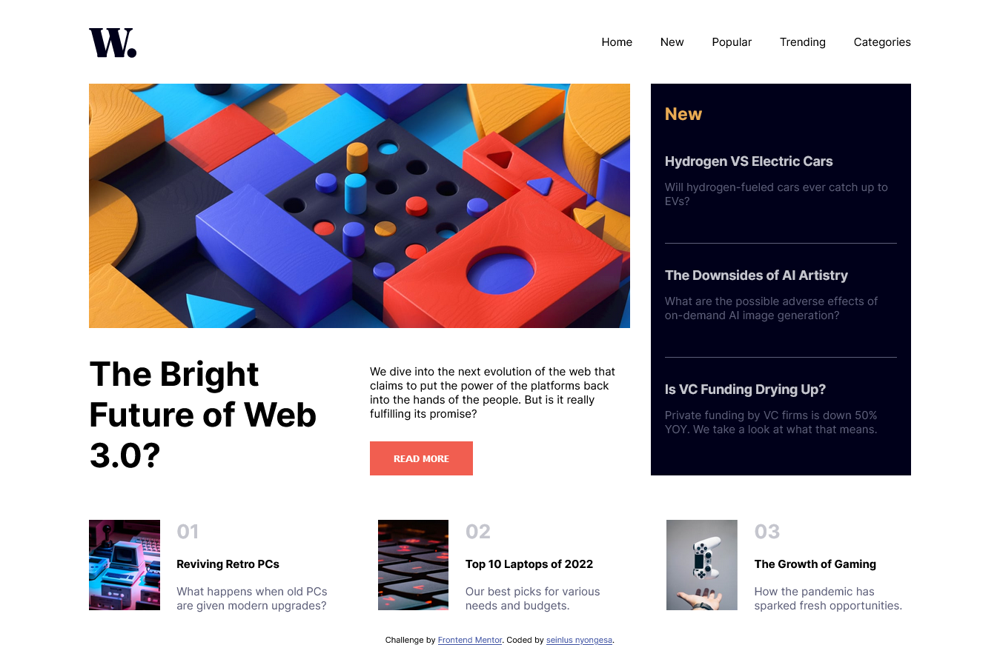

# Frontend Mentor - News homepage solution

This is a solution to the [News homepage challenge on Frontend Mentor](https://www.frontendmentor.io/challenges/news-homepage-H6SWTa1MFl). Frontend Mentor challenges help you improve your coding skills by building realistic projects.

## Table of contents

- [Overview](#overview)
  - [The challenge](#the-challenge)
  - [Screenshot](#screenshot)
  - [Links](#links)
- [My process](#my-process)
  - [Built with](#built-with)
  - [What I learned](#what-i-learned)
  - [Continued development](#continued-development)
  - [Useful resources](#useful-resources)
- [Author](#author)

## Overview

### The challenge

Users should be able to:

- View the optimal layout for the interface depending on their device's screen size
- See hover and focus states for all interactive elements on the page

### Screenshot



### Links

- Solution URL: [Add solution URL here](https://your-solution-url.com)
- Live Site URL: [Add live site URL here](https://your-live-site-url.com)

## My process

### Built with

- Semantic HTML5 markup
- CSS custom properties
- Flexbox
- CSS Grid
- Mobile-first workflow

### What I learned

I lernt the grid template-area syntax as illustrated by the following code snippets:-

```html
<div class="grid">
	<div class="area1"></div>
	<div class="area2"></div>
	<div class="area3"></div>
	<div class="area4"></div>
</div>
```

```css
.grid {
	display: grid;
	grid-template-columns: repeat(3, 1fr);
	grid-template-rows: 2fr 1fr;
	grid-template-areas:
		"area1 area1 area2"
		"area3 area3 area4";
}

.area1 {
	grid-area: area1;
}
.area2 {
	grid-area: area2;
}
.area3 {
	grid-area: area3;
}
.area4 {
	grid-area: area4;
}
```

### Continued development

I would like to learn about animations and be really confortable with keyframe animations and simple page transitions.

### Useful resources

- [w3schools](https://www.w3schools.com) - This came in handy when I was strugling to remember the grid-templete-area syntax. I really liked this pattern and will use it going forward.

## Author

- Website - [seinlus nyongesa](https://portfolio-v2-ashen-six.vercel.app/)
- Frontend Mentor - [@seinlusnyongesa](https://www.frontendmentor.io/profile/seinlusnyongesa)
